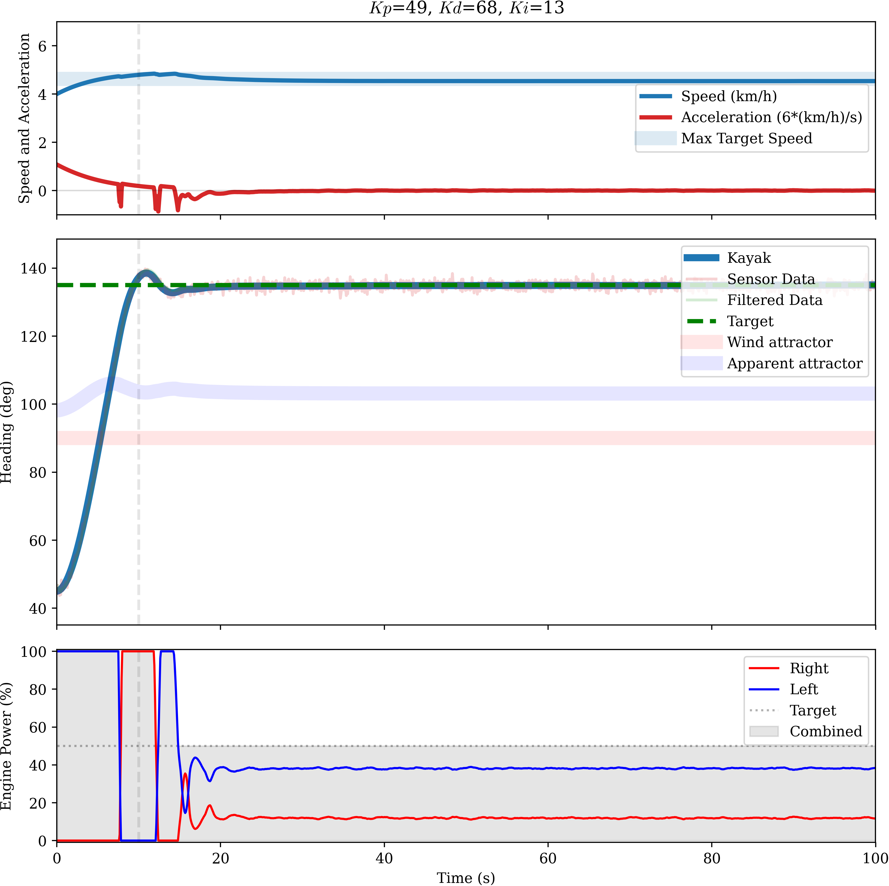

# Autonomous kayak

This package includes code to assemble, simulate, optimize and implement an autonomous twin-engine kayak controlled by a smartphone. The kayak simulation suite, written in Python, uses kayak and weather (wind, current) parameters to realistically simulate the kinematics of a twin-engine kayak. Turning is achieved via differential thrust. The simulation suite includes a simulated PID control loop, which allows control parameters to be optimized for any kayak under any weather condition. The real-life control code is then implemented on an Arduino (C code provided), which uses pulse width modulation to control the output of each engine. The sensors and user interface are implemented on a mobile phone app (Android or iOS), from which the kayak is controlled via Bluetooth.

Below is an example of the simulated kayak making a turn and following the new heading autonomously, where time is on the horizontal axis. The top figure shows the speed and acceleration, the middle figure shows the heading of the kayak and the turning tendency imparted by wind,

The application interface is easy to use and highly customisable:

## Features

- Built-in .apk (Android) and .ipa (iOS) apps for instant kayak control.
- Uses the built-in phone sensors for navigation.
- Different autopilot modes to optimise for speed, efficiency and a pivot mode to turn in narrow spaces.
- Single engine mode: control the power output of a single-engine kayak from your smartphone.
- Live diagnostics: live information from the kayak is displayed on the smartphone.
- Power, battery and energy usage data on the smartphone.
- Efficient Python, Arduino and mobile implementations.
- Modular simulator and autopilot.
- Kalman filter reduces the compass sensor noise by a factor of 100.
- Realistic sensor noise implementation, based on real-life data characterisation.
- Very realistic physics. Hydrodynamic drag and friction, wind drag and wind torque and engine outputs are carefully characterized, calibrated, implemented and tested.
- Kayak kinematics can easily be calibrated with 3 standard real-life tests to suit any kayak.
- Built-in PID optimizer, allowing optimization under different weather conditions.
